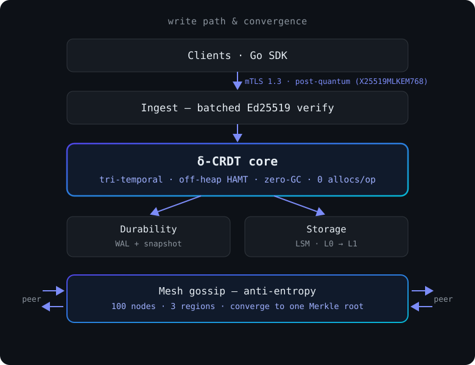

<div align="center">
  <picture>
    <source media="(prefers-color-scheme: dark)" srcset="docs/assets/logo-dark.svg">
    <source media="(prefers-color-scheme: light)" srcset="docs/assets/logo-light.svg">
    
  </picture>

  <h1>Sovereign Engine</h1>

  <p><strong>A fast, globally-consistent, quantum-resistant database engine.<br/>
  Every number below is measured on real hardware. None of it is marketing.</strong></p>

  <p>
    <a href="LICENSE"></a>
    <a href="https://go.dev"></a>
    <a href="https://go.dev"></a>
    <a href="https://github.com/hr18vk/sovereign/actions/workflows/gatekeeper.yml"></a>
    <a href="https://github.com/codespaces/new?hide_repo_select=true&amp;ref=main&amp;repo=hr18vk%2Fsovereign"></a>
  </p>
</div>

---

## What is this, in plain terms?

Sovereign Engine is a database engine: the layer that sits underneath almost every app and actually stores its data.

Right now, databases make you pick. You can have one that's **fast**, or one that stays **correct when a hundred machines write to it at once across the world**, or one that's **safe against the quantum computers people are building**. Getting all three at once is supposed to be nearly impossible, so big companies spend millions of dollars a year duct-taping it together.

This engine does all three at once:

- **Fast** — millions of verified operations a second on one server.
- **Globally consistent** — writes from many places converge to the same answer on their own. No leader, no lost updates. (Checked on a 100-node fleet across 3 cloud regions.)
- **Quantum-resistant** — every connection between nodes already uses post-quantum encryption, so traffic recorded today can't be unlocked later by a quantum computer. (Post-quantum *signatures* are built and tested too, behind a flag.)

And I'm not asking you to take my word for it. Every number here is a real measurement, and the exact command, the machine and the unedited output are in the repo so you can check my work. That matters more to me than sounding impressive.

**Want the longer version, without the jargon?** [**What this is, in plain English**](https://sovereignengine.space/what-is-sovereign-engine) walks through the problem the engine solves, how it actually works, what every published number does and does *not* mean, and what isn't finished yet. No prior database knowledge assumed, and it ends with a glossary.

> **Status: research preview.** This is not production-ready software. It's a working, measured engine I'm publishing early so the design and the numbers can be checked. See [Where it stands](#where-it-stands) for the honest boundary.

## Why I built this

It bothered me that "pick two out of three" was treated as normal for something as basic as a database. So I tried to build one that doesn't make you choose.

Most of the work was not the parts that worked. A node's shutdown path unmapped its memory arena while background reclamation was still walking it, which is a use-after-free at fifty million operations a second. The write-ahead log held its lock across a blocking `fsync` and starved the very writes it was protecting. A seed node sat with one commit in flight for over 300 seconds, and the cause turned out to be a checkpoint flush sitting on the commit path; moving it off brought the same run down to 8.3 seconds. Each of those has a decision record with the root cause, the fix and the measurement, and the bigger ones are written up in the [post-mortem](docs/architecture/6_ENGINEERING_POST_MORTEM.md). The dead ends are where the engineering actually is.

## Who needs this

Anywhere data gets written in more than one place and losing a write isn't acceptable:

- **Multi-region applications** that pay a cross-ocean round trip on every write, or quietly accept last-writer-wins and the updates it throws away.
- **Audited domains** like finance, insurance, healthcare and logistics, which have to answer "what did we believe, and when" months after the fact, not just "what is true now".
- **Edge and offline-first fleets** where nodes go dark for hours and have to rejoin without a person reconciling anything by hand.

Those are one problem wearing three hats. The usual answer is a stack of separate systems with a reconciliation job in the middle that nobody entirely trusts. This engine is an attempt to make it one system, where merging is arithmetic and there is nothing left to reconcile.

## Why it's different

Four design choices, each with its real status stated rather than implied:

| | |
|:--|:--|
| **Tri-temporal CRDT state** | Every fact carries `system × valid × assertion` time, so you can ask "what did we know, and when." Concurrent writers converge without a leader or a coordinator. XTDB is bitemporal, Datomic keeps transaction time, and neither of them converges without coordination; all three clocks *plus* leaderless convergence is the combination I couldn't find anywhere else. |
| **Geospatial axis, reserved in the record** | Every fact carries an H3 cell alongside its three clocks — on the wire and in storage — so spatial state belongs to the CRDT rather than to a bolted-on index. The producer that fills those cells is built but not yet wired into the write path, so this is a **reserved axis today, not a live index**. |
| **Post-quantum transport, on by default** | Every node-to-node connection negotiates X25519MLKEM768, so traffic captured today isn't decryptable by a future quantum computer, and a test asserts the *negotiated* curve ID rather than trusting the config. Hybrid Ed25519 + ML-DSA-65 signing is built and tested, with both signatures required to accept a frame, but it stays **opt-in** (`--hybrid-sign`, `--hybrid-verify`) so the default wire format remains byte-identical for peers that don't have it. |
| **Zero-GC** | The write path does **0 allocations per op**, because state lives in an off-heap arena the Go garbage collector never walks. |

<p align="center"></p>

---

## The measurement that changed the design

The hot path is a lock-free stack, so the obvious contention point is the stack head. I sharded it. Throughput barely moved.

It took me a while to see why. Every core refilling its local cache was still issuing a compare-and-swap against one global free-list head, and that single word sat on one cache line that all 32 cores were now fighting over. I hadn't removed the contention, I'd relocated it. The cores weren't short of memory bandwidth; they were serializing on cache coherence, and from a profile that only shows you elapsed time the two look identical.

The measured cost of that one shared line is **1.1M ops/s at 32 cores, which is 1.6% parallel efficiency**. Dispersing the locus across 64 home-shard lines took the same engine to **50.7M–68.3M ops/s**, roughly 46× to 62×.

Two things came out of it. Every contended atomic now gets a 128-byte stride of its own, checked by a layout gate in CI, and I place that padding by hand because an automatic formatter has silently destroyed it before. And the benchmark that records the 1.1M failure is still in the tree, skipped, with the reason and the number written into the skip, because deleting it would let someone later assume the old design was merely slower. The full account is in [the post-mortem](docs/architecture/6_ENGINEERING_POST_MORTEM.md).

## The measured numbers

> **Two layers, never mixed up.** The CRDT **core** number is an in-process data-structure test with no crypto, no network, no TLS and no disk. The **production ingest** number is the real receive path (signature verify + apply + envelope). They're different things, so I show both. That way neither one gets misread.

| Layer | Number | Where it's from |
|:--|:--|:--|
| **CRDT core** | gate floor **50,736,038 ops/s**; this tree re-measured **68,278,197 ops/s** on 32 cores | `TestScalingGate` · c8g.8xlarge (Graviton4) · Go 1.26.1 |
| **Production ingest** | **5.7M–6.0M deltas/sec** on 32 cores (N=100–256; ceiling 12.5M–14.7M) | `BenchmarkBatchedVerifyParallel` · measured 2026-09-15 |
| **Hot-path allocations** | **0 allocs/op, 0 B/op** | `TestHotPathZeroAllocations` |
| **Convergence** | 100 nodes / 3 regions agree in **6.6–10.2s** | real silicon, integrity checks on |

Every one of these is reproducible. The exact command, the machine and the unedited output are in [docs/evidence/](docs/evidence/). **That's my substitute for an outside audit: you don't have to trust the numbers, you can re-run them.**

### How it compares

Numbers only mean anything at the same layer, so read the **Workload** and **Hardware** columns before the **Throughput** one. Note what the ingest row is paying that the in-memory rows are not: a cryptographic signature verified on every single operation.

| System | Workload | Hardware | Throughput |
|:--|:--|:--|:--|
| **Sovereign — production ingest** | signature-verified write path (Ed25519) | Graviton4, 32 cores | **5.7M–6.0M deltas/s** |
| **Sovereign — CRDT core** | in-process data structure (no network/crypto/disk) | Graviton4, 32 cores | **50.7M–68.3M ops/s** |
| Dragonfly | in-memory, write / read | 48 cores | 4.2–5.2M write · 4–15.5M read |
| Redis | in-memory SET | single core | ~72K (1.8M pipelined) |
| FoundationDB | 90/10 transactional | 24-machine cluster | 8.2M ops/s |
| TigerBeetle | transfers (batched, durable) | single core, replicated | ~100K–450K/s |
| ScyllaDB | durable write | per node, RF=3 | ~75K ops/s |
| CockroachDB | TPC-C | multi-node, 3× replicated | 128,000+ tpmC |
| PostgreSQL | durable writes (pgbench) | single node | ~5K–12K TPS |

The bottom rows pay for durability and replication on every operation. Sovereign's ingest number does **not** yet carry that cost, which is what "research preview" means in practice. The full methodology and the source for every figure: **[Full benchmark comparison →](https://sovereignengine.space/benchmark-comparison)**

---

## Try it

It builds and runs on any Linux box (and the Codespace installs the one dependency for you):

```bash
git clone https://github.com/hr18vk/sovereign.git
cd sovereign
sudo apt-get install -y libjemalloc-dev    # the one dependency
go build ./...                             # builds the engine
go test ./pkg/sync/ -run TestHotPathZeroAllocations -v  # the zero-GC gate
```

That last command is the memory law. On a clean tree it prints:

```
--- PASS: TestHotPathZeroAllocations (0.00s)
ok      github.com/hr18vk/sovereign/pkg/sync    0.006s
```

Or open a ready-to-run [GitHub Codespace](https://github.com/codespaces/new?hide_repo_select=true&ref=main&repo=hr18vk%2Fsovereign), where the dependencies are already installed.

The full 3-node mesh walkthrough (dev CA, node identity, the SDK) is in [docs/sdk-quickstart.md](docs/sdk-quickstart.md). The 32-core benchmark (`scripts/benchmark.sh`) self-skips on smaller machines. On a laptop it still builds and runs, it just won't reproduce the headline number, which needs the named ARM64 box. That's the honest truth of it.

---

## Where it stands

**Research preview, not production-ready.** The hard part is done and verified on real hardware. The parts that make a database safe to depend on are not finished, so don't trust it with data you can't afford to lose. What's left is hardening and the developer-facing surface. By my own count the v1.0 feature set is roughly **57% landed**.

| Capability | Status |
|:--|:--|
| Mesh — 100 nodes, 3 regions, mTLS | ✅ Verified |
| Convergence — 10K keys across the fleet | ✅ Met (6.6–10.2s) |
| Crash recovery | ✅ Proven (root re-equals after a kill) |
| Durability — WAL fsync per batch | ✅ Held on every run |
| Convergence tail (last 1–2 of 100 nodes) | 🟡 Still hardening (~1 run in 7 straggle) |
| Production PKI / HSM · io_uring · gRPC API | ⬜ Planned |

The honest boundary, and the evidence tier behind each row, is on the [verification page](https://sovereignengine.space/docs/architecture/verification).

---

## Read more

- [SUPREMUM_STYLE.md](SUPREMUM_STYLE.md) — the engineering laws every change has to obey.
- [docs/architecture/](docs/architecture/) — architecture, benchmarks, and the honest post-mortem.
- [docs/architecture/adr/](docs/architecture/adr/) — the decision log (50+ ADRs: root cause → change → measured result).
- [docs/evidence/](docs/evidence/) — the raw silicon receipts behind every number.
- [Developer portal](https://sovereignengine.space) — the same docs, rendered.

> **On the name.** The original codename was *supremum*, the mathematical least-upper-bound, which is exactly what a CRDT merge computes. The project and the Go module path are **Sovereign Engine**; the codename survives only in a few internal identifiers (`supremum_*` metrics, `SUPREMUM_*` environment knobs, `SUPREMUM_STYLE.md`).

## About the author

Built by **Harsh Rawat**, working solo. I use AI coding tools the same way I use a profiler or a debugger. The architecture, the design decisions and the failures above are mine, and every number in this repo is one I ran and read myself.

## License

Source-available under the [Business Source License 1.1](LICENSE) — Licensor **Harsh Rawat** ("Sovereign Engine" is the project name, not a company). Non-Production Use is free; Production Use needs a written grant until the **Change Date 2029-08-15**, when it converts in perpetuity to an unencumbered license.
